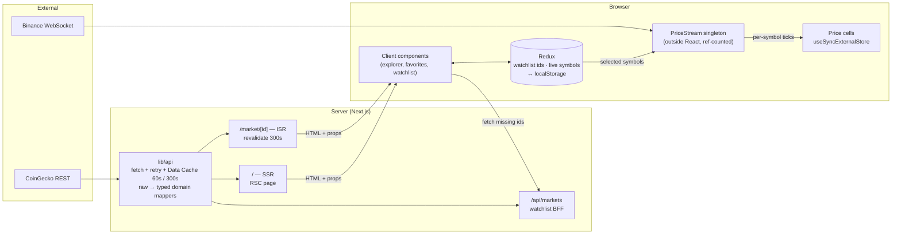

# CoinPulse — Real-Time Crypto Market Intelligence

A compact, production-minded crypto dashboard: discover the top 250 assets, search/filter/sort them, open a detail page with a 7-day chart, keep a personal watchlist and follow a live Binance price stream.

**Live URL:** https://nmo-crypto-dashboard.vercel.app · **Repository:** https://github.com/Safwatbilal/nmo-crypto-dashboard

| Route | What | Rendering |
| --- | --- | --- |
| `/` | Market overview: global stats, live widget, top movers, explorer table | **SSR** (request time) + cached upstream data |
| `/market/[id]` | Asset details, 7-day chart, stats, live price | **ISR** (`revalidate = 300`, generated on demand) |
| `/watchlist` | Saved assets with prices (live where available) | **Static shell** + client data |
| `/api/markets?ids=` | Market rows for watchlist ids (BFF) | Route handler, Data Cache 60s + CDN `s-maxage=60` |
| `/sitemap.xml`, `/robots.txt`, `/opengraph-image`, `/manifest.webmanifest` | SEO / metadata files | Next.js file conventions |

---

## Tech stack

- **Next.js 16.4** (App Router, Turbopack) · **React 19.3** · **TypeScript** (strict)
- **Redux Toolkit 2** + React Redux 9 — shared client state only
- **Motion** (Framer Motion, `motion/react`) via `LazyMotion` + `m.*`
- **Tailwind CSS v4** with design tokens (oklch palette, light/dark), `cva` for component variants
- **TanStack Table** (headless) behind a presentational `DataTable` (column/row model; responsive table ↔ cards). Filtering, sorting and paging stay in `lib/market/query.ts` because the URL owns them.
- **sonner** toasts for watchlist feedback · **nextjs-toploader** navigation progress bar
- Inline SVG icon components behind a typed `IconRenderer` (`assets/icons`), `next/font` (Geist), `next/image`
- **Vitest** unit tests · ESLint (`eslint-config-next`, React Compiler lint rules) · GitHub Actions CI

## Local setup

```bash
npm ci
cp .env.example .env.local   # optional — everything works with no variables
npm run dev                  # http://localhost:3000

npm run lint                 # ESLint
npm run typecheck            # next typegen + tsc --noEmit
npm test                     # Vitest
npm run build && npm start   # production build
```

Requires Node 20.9+ (CI uses Node 24).

## Environment variables

Copy `.env.example` to `.env.local`. All config lives there — the code has no hardcoded fallbacks and reads it only through `lib/env.ts` (public) and `lib/env.server.ts` (server only). Required variables throw a clear error when missing; no secrets are committed.

| Variable | Scope | Purpose |
| --- | --- | --- |
| `NEXT_PUBLIC_SITE_URL` | public, **required** | Absolute base for canonical URLs, OG, sitemap (`http://localhost:3000` locally, `https://nmo-crypto-dashboard.vercel.app` in production). Vercel preview deployments are always `noindex`. |
| `COINGECKO_API_BASE_URL` | server only, **required** | CoinGecko REST base URL (`https://api.coingecko.com/api/v3`). |
| `NEXT_PUBLIC_BINANCE_WS_URL` | public, **required** | WebSocket endpoint (`wss://data-stream.binance.vision/ws`). |
| `COINGECKO_API_KEY` | **server only** | Optional free CoinGecko *Demo* key, sent as `x-cg-demo-api-key`. Raises the rate limit; never reaches the browser. |
## Data sources

- **REST — CoinGecko public API v3**: `/coins/markets` (top 250, plus by-ids for the watchlist), `/global`, `/coins/{id}` (with `sparkline=true` — one call gives stats *and* the 7-day chart).
- **WebSocket — Binance public market streams**: `<symbol>@miniTicker` (1 update/s per symbol) over a single connection using `SUBSCRIBE`/`UNSUBSCRIBE` messages. `data-stream.binance.vision` is Binance's market-data-only endpoint, which is reachable from regions where `stream.binance.com` is blocked.

Attribution is shown in the footer and on every asset page.

---

## Architecture

```
app/                     routes, metadata files, error/not-found boundaries
  page.tsx               SSR market overview
  market/[id]/page.tsx   ISR asset page (+ not-found.tsx)
  watchlist/page.tsx     static shell
  api/markets/route.ts   BFF for the watchlist
components/
  market/  asset/  live/  watchlist/   feature components
  ui/                    presentational primitives (Button, Card, StatePanel, TrendBadge…)
  layout/ providers/     header/footer/theme, Redux + Motion providers
lib/
  api/                   CoinGecko client (server-only), fetch+retry, raw→domain mappers
  market/                pure query logic (parse/filter/sort/paginate), chart geometry
  live/                  PriceStream (WebSocket manager), symbol mapping
  seo/  utils/           site config, JSON-LD, formatting
hooks/                   useLiveTicker, useConnectionStatus, useWatchlistMarkets
store/                   store factory, typed hooks, persistence middleware, slices
types/                   domain types + typed upstream payloads
tests/                   Vitest unit tests
```

### Data flow



- **What runs on the server:** all CoinGecko access (API key stays private, responses are shared through the Data Cache), HTML for the overview/asset pages, the SVG chart, metadata and JSON-LD.
- **What runs in the browser:** search/filter/sort/pagination interaction, watchlist + live-symbol state, the WebSocket, theme toggle, animations.
- Server data is **never copied into Redux**. The market list is passed as props to the one client component that needs it.

## Rendering strategy

**`/` — SSR.** The page renders whatever view the URL describes (`?q`, `?sort`, `?filter`, `?page`). That's an unbounded set of combinations that can't be prerendered, and a shared or crawled link must return exactly that view as HTML (the WebSite JSON-LD even advertises `/?q=` as a search action). Reading `searchParams` makes the route dynamic.
Request-time rendering does **not** mean request-time fetching: each fetch carries `next.revalidate` (markets 60s, global stats 300s), so every visitor shares one cached CoinGecko response. I deliberately did *not* use `dynamic = "force-dynamic"`, because it also forces every fetch to `no-store` and would hit the rate limit on every page view. The sections stream behind `<Suspense>` skeletons, so the shell and heading arrive immediately.

**`/market/[id]` — ISR, `revalidate = 300`.** Asset pages are identical for everyone and only need to be as fresh as the upstream, which updates roughly every minute. The real-time element is the client-side WebSocket price layered on top. Pages are served from cache (verified: first request `x-nextjs-cache: MISS`, then `HIT` in ~6 ms) and regenerated in the background at most every 5 minutes; if a regeneration fails, the stale page keeps being served.
`generateStaticParams` returns `[]` on purpose. Nothing is prerendered at build, so **the build never depends on a rate-limited third-party API**. Every asset is still cached after its first visit, and `dynamicParams` stays `true`.
Unknown ids call `notFound()` before any streaming starts, so they return a real **404 status**. That's why this segment has no `loading.tsx`: a Suspense boundary there would start streaming and turn the 404 into a soft-404 with status 200. Instead, rows show an inline `useLinkStatus` spinner during that first navigation.

**`/watchlist` — static shell + client data.** The list lives in the visitor's `localStorage`, so the server can't know what to render. The shell is prerendered, and prices come from `/api/markets`. The page is `noindex` because it's personal content.

**Why Cache Components is off.** Next 16.4's template enables `cacheComponents`. I turned it off to use the explicit segment config (`revalidate`, `dynamicParams`), which makes SSR vs ISR auditable in one line per route, and because under PPR a streamed `notFound()` produces a soft-404. With more time I'd migrate to `"use cache"` + `cacheLife` (see Known limitations).

## Redux state design

Two small slices, built with `combineSlices` and RTK `selectors`:

| Slice | State | Why it's in Redux |
| --- | --- | --- |
| `watchlist` | `ids: string[]`, `hydrated: boolean` | Read/written by the table stars, asset page, nav badge, explorer's "Watchlist" filter and the watchlist page. Persisted. |
| `live` | `symbols: string[]` | Shared by the home live widget and the asset page's "Follow live" toggle. Persisted. |

Deliberately **not** in Redux:
- **Market/asset data**: server-fetched and passed as props. Next's cache primitives are enough, so a client cache would duplicate it.
- **Live ticks**: ~1 update/s per symbol would rerun every `useSelector` in the app. They live in `PriceStream` (below).
- **Explorer filters**: owned by the URL (shareable, SSR-able) plus local state, with one consumer.
- **Theme**: must apply before hydration (inline script), so the `dark` class on `<html>` is the source of truth. Its two consumers (theme toggle, toaster) read it through `useTheme()` (`useSyncExternalStore` over a `MutationObserver`), so no store has to mirror it and no second state library is needed.

**Selectors** return primitives or stored references (`selectIsInWatchlist(state, id)` → boolean), so none needs `createSelector`. The one derived collection (filtered + sorted list) is computed with `useMemo` where it's used.

**Persistence** is a listener middleware that writes only on user actions (`watchlistToggled/Removed/Cleared`, `liveSymbolToggled`), never on hydration. Keys are versioned (`coinpulse:watchlist:v1`), and values are validated on read: unknown symbols, malformed ids and corrupt JSON fall back to defaults. A `storage` event listener keeps open tabs in sync.

**Hydration safety.** The store is created per request (`makeStore` in `useState`), so state never leaks between users. Server and first client render share the same default state, and storage is applied in an effect after mount. Star buttons stay disabled until `hydrated` is true, so an early click can't be overwritten. `<Provider serverState={initialSnapshot}>` makes Suspense boundaries that hydrate *later* (the streamed market table) hydrate against the initial state rather than the already-loaded store. Without it, React would keep a mismatched `disabled` attribute from the server HTML. This bug was caught during the browser smoke test (see AI usage).

## Real-time WebSocket design

`lib/live/price-stream.ts` is a framework-agnostic `PriceStream` class (a browser singleton):

- **One multiplexed connection** for the whole app. Symbols are **ref-counted**: the first consumer sends `SUBSCRIBE`, the last one leaving sends `UNSUBSCRIBE`. With no consumers left, the socket closes after a 5s idle grace period, so a route change (home → asset page) doesn't tear down and reopen it.
- **Status:** `idle → connecting → connected → reconnecting → disconnected`. It's shown by `<ConnectionStatus>` with a dot *and* a text label, and a **Reconnect** button appears once retries give up.
- **Reconnect:** capped exponential backoff with equal jitter (0.5–1s, 1–2s, … max 30s) and up to 6 attempts. Everything resubscribes on reopen. `offline` pauses immediately, and `online` reconnects.
- **Watchdog:** a connection that silently stops delivering messages for 20s is recycled.
- **Cleanup:** intentional closes detach handlers first, so they never trigger a reconnect. Unmounting components unsubscribe through the `useSyncExternalStore` cleanup.
- **Rerender containment:** ticks never touch React state or Redux. `useLiveTicker(symbol)` uses `useSyncExternalStore` with a per-symbol subscription, so a BTC tick re-renders only the BTC price cell. The widget itself re-renders only when the followed symbol list changes, and status changes re-render only the status badge.
- The widget is **code-split and client-only** (`next/dynamic`, `ssr: false`), so neither its JS nor the socket is in the critical path.

All of this is covered by unit tests with a fake socket and fake timers (`tests/price-stream.test.ts`).

## Performance decisions

Memoization is used only where the data flow gives it a concrete job:

| Where | What | Why |
| --- | --- | --- |
| `MarketExplorer` | `useMemo` filter + sort (250 items) | Otherwise it runs on every render (keystrokes, watchlist toggles). The watchlist `Set` is a dependency **only** when the Watchlist filter is active, so starring in the "All" view doesn't recompute. |
| `MarketExplorer` | `useDeferredValue(query.q)` | The input stays urgent and filtering renders at lower priority. Together with the memoized table, typing never waits on table work. |
| `MarketTable` | `React.memo` | During urgent keystroke renders its props (deferred page of results) are unchanged, so it skips. |
| `DataTableRow` | `React.memo` | TanStack keeps row objects stable while `data` is unchanged, so rows skip re-rendering when only the shell (title, toolbar) changes. |
| `DataTablePagination` | `React.memo` + `useCallback(goToPage)` in `MarketExplorer` | Stable callback lets pagination skip every keystroke render. |
| `LiveTickerCard` | `React.memo` + `useCallback(toggle)` | Adding or removing one symbol doesn't re-render the other cards. Each card owns its tick subscription. |
| `useLiveTicker` | `useCallback(subscribe)` | `useSyncExternalStore` resubscribes when `subscribe` changes identity, which here would mean an UNSUBSCRIBE/SUBSCRIBE round-trip per render. |
| `FavoriteButton` | own `useAppSelector` boolean | Toggling a star re-renders exactly one button, not the table. |

**Intentionally not memoized:** `TrendBadge`, `CoinAvatar`, toolbar handlers (the toolbar re-renders on every keystroke anyway), stat cards and the chart (Server Components with no client re-render), and slice selectors (they return primitives).

**React Compiler is not enabled.** All memoization above is explicit. ESLint's `react-hooks/incompatible-library` rule flags `useReactTable` because the compiler can't memoize TanStack's function-returning API. Since the compiler is off, that rule is suppressed on that one line with a comment explaining why.

Other measures:
- **Client boundaries are leaves.** Pages, stats, top movers, the chart, the asset page and layout chrome are Server Components. The `"use client"` files are interactive leaves only.
- **Zero-JS chart:** the 7-day chart is SVG built on the server and cached in the ISR HTML, with no chart library in the bundle.
- **Motion:** `LazyMotion` + `domAnimation` with `m.*` components (strict mode) instead of the full `motion` component.
- **Controlled DOM:** 20 rows per page. Less important columns are hidden with responsive classes rather than rendering a second mobile layout.
- **Images:** `next/image` with fixed sizes and `remotePatterns`. Only the asset logo is preloaded.
- **Icons:** `IconRenderer` is a Server Component over a static map of inline SVG components, so icons are in the server HTML. There's no client chunk per icon and no empty placeholder before hydration.
- **Payload:** upstream responses are mapped to slim domain objects before reaching client props.
- Server-side `fetch` retries 429/5xx once with `Retry-After`-aware backoff. Only 200 responses enter the Data Cache.

### Lighthouse

Measured with Lighthouse 13.5: desktop preset, and the default mobile profile (Moto G Power emulation, simulated slow 4G, 4× CPU throttling).

| Page | Profile | Build | Perf. | A11y | Best pr. | SEO | LCP | CLS | TBT |
| --- | --- | --- | --- | --- | --- | --- | --- | --- | --- |
| `/` | Desktop | Vercel | 99 | 100 | 100 | 100 | 0.7 s | 0 | 0 ms |
| `/market/bitcoin` | Desktop | Vercel | 98 | 100 | 100 | 100 | 0.7 s | 0 | 40 ms |
| `/` | Mobile | Vercel, before CLS fix | 73 | 100 | 100 | 100 | 2.0 s | 0.134 | 830 ms |
| `/` | Mobile | local `next start`, after fix | 80–84 | 100 | 100 | 100 | 3.7 s\* | 0 | 270–340 ms |
| `/market/bitcoin` | Mobile | local `next start`, after fix | 90–92 | 100 | 100 | 100 | 3.4 s\* | 0.001 | 30–130 ms |

\* Local runs have no CDN, so LCP is higher than on Vercel (2.0 s there).

The first mobile audit of `/` found **CLS 0.13**, caused entirely by the lazily loaded live widget: its skeleton was shorter than the real widget on phones (the "Follow more" chips wrap to three rows, the header wrapped once the status pill appeared, and the price placeholder was shorter than a rendered price). Fixes: the skeleton now reuses the real header (`LiveWidgetHeader`) and mirrors card heights and chip rows, the status pill moved to the title row so its label width can't change the header height, and the price placeholder reserves a full line box. All widths from 320px to 1024px now render the skeleton and the real widget at identical heights, and **CLS dropped to 0**.

The remaining mobile cost is TBT from hydrating React + Redux + Motion on a throttled CPU. Next steps: defer the live widget until idle/visible, and trim the explorer's client bundle.

## SEO

- **Metadata API:** root defaults (`metadataBase`, title template, OG, Twitter), a unique title, description and **canonical** URL on every page.
- **Dynamic metadata** for assets (`generateMetadata`): name, symbol, price, 24h change, market cap and rank, plus an OG image. It shares one upstream call with the page through React `cache()`.
- **`robots.ts`** allows everything except `/api/`. **`sitemap.ts`** lists the home page plus the top 100 asset pages. If the API is down it falls back to the home URL instead of failing.
- **JSON-LD:** `WebSite` with `SearchAction` (home), `ItemList` of the top 10 assets (home), `BreadcrumbList` (asset). It's escaped against `</script>` injection.
- **`opengraph-image.tsx`** generates the default social card at build time. `manifest.ts` is included too.
- **Crawlable content:** primary content is server-rendered with one `h1` per page and `h2`s per section. Filtered views canonicalize to `/`, and the watchlist is `noindex, follow`.

## Accessibility

- A skip link, landmarks (`header`, `nav`, `main`, `footer`) and `aria-current` on the active nav item, breadcrumb and page.
- Visible `:focus-visible` outlines on all controls, and keyboard access for every interaction (native buttons, links, `select`).
- Labelled search input and sort select. Icon-only buttons have `aria-label`s, and toggles use `aria-pressed`.
- **Not colour-only:** price changes use sign + ▲/▼ + screen-reader text ("up"/"down"). Live status uses a dot *and* a label, and live ticks show an arrow.
- Table semantics: `<caption>`, `scope="col"` and row headers. Result counts are announced through `aria-live="polite"` (individual price ticks aren't announced).
- The chart is `role="img"` with a text summary (start, end, range).
- **Reduced motion:** `MotionConfig reducedMotion="user"` plus a CSS `prefers-reduced-motion` override for keyframe flashes and the theme reveal.
- Contrast: tokens are tuned per theme (e.g. a lighter primary and positive/negative colours in dark mode).

## Motion

Animations support usability: a sliding pill on the filter control (`layoutId`), a spring on the favorite star, entry fades when rows change *after* user interaction (server-rendered rows are never hidden waiting for JS, which protects LCP), add/remove animations for live cards and watchlist cards (`AnimatePresence popLayout`), CSS-only stat card entrance, a price flash, and a circular theme reveal through the View Transitions API.

## Resilience

- **REST failures:** the market section renders an inline error with **Try again** (`router.refresh`). Stats and movers degrade silently. Route-level `error.tsx` uses Next 16.4's `retry()`, and `global-error.tsx` is a last resort. Server errors log their digest.
- **Watchlist fetch failure:** an inline retry that requests only the missing ids.
- **Defensive mapping:** every upstream field is nullable in the raw types and normalized to `null`, and the UI renders "—". The `/global` endpoint was observed returning a corrupt 24h volume ($14,000T against a $2.8T market cap), so implausible aggregates are dropped (`plausibleVolume`, tested).
- Input validation for URL params (whitelists, length caps, page clamping) and `/api/markets` (id regex, max 50 ids → 400).
- Security headers (`nosniff`, `Referrer-Policy`, `X-Frame-Options`), external links use `rel="noopener noreferrer"`, and the `x-powered-by` header is removed.

## Testing & verification

- `npm test` runs **38 unit tests**: query parsing, URL round-trips, filter/sort (nulls last, no mutation), pagination clamping, the page window, mappers on sparse payloads, sparkline timestamps, chart geometry, formatters, slices, persistence (no write on hydrate, corrupt-data recovery), and the WebSocket lifecycle (ref-counting, per-symbol notification, idle close, cancelled idle close, backoff, give-up and retry, watchdog).
- Lint, typecheck and a production build pass, and CI runs all four on every PR.
- **Manual smoke test** (production build, real APIs, headless Chrome at 1366px light and 375px dark): SSR of a shared filtered URL, search → URL sync, the watchlist filter, persistence across reloads, live widget editing, ISR `MISS → HIT`, invalid id → **404**, no horizontal overflow on mobile, keyboard order starting with the skip link, and **no console errors** in the main journey.

## Deployment

Vercel (free tier) supports SSR, ISR and route handlers with zero config:

1. Push this repository to GitHub.
2. Import it at vercel.com/new (framework is auto-detected, no settings required).
3. Optional: add `COINGECKO_API_KEY` (recommended, since the keyless public API is shared and aggressively rate-limited for cloud IPs). Set `NEXT_PUBLIC_SITE_URL` when using a custom domain.

The build makes no upstream calls except the sitemap's, which degrades gracefully, so it succeeds even if CoinGecko is rate-limiting.

---

## AI usage

**Tools:** Claude (Claude Code) as a pair programmer in the editor and terminal.

**What it accelerated:** scaffolding and folder structure, typed API payloads and mappers, Tailwind component markup, the test suites, the headless-browser smoke script, and the first drafts of this README.

**Suggestions rejected or corrected after review:**
1. **Hydration bug.** The first version of the store provider let streamed Suspense content hydrate against the already-hydrated Redux store. All star buttons stayed `disabled` in production because React doesn't patch mismatched attributes. A browser smoke test caught it, and it was fixed with `Provider serverState`.
2. **`dynamic = "force-dynamic"` for the SSR route** was rejected. It also forces every `fetch` to `no-store`, which would hit CoinGecko on every page view. Reading `searchParams` gives request-time rendering while the data stays cached.
3. **A root `loading.tsx`** was removed because it wrapped `/market/[id]` in Suspense, so `notFound()` happened after streaming began and returned **200** instead of 404.
4. **Keeping the template's `cacheComponents: true`** was reviewed against the bundled 16.4 docs and turned off (reasons above). The docs also showed that 16.4 error boundaries receive `retry()` rather than the older `reset()`, and that `next/image` `priority` is deprecated in favour of `preload`.
5. **`try/catch` around JSX** in Server Components was flagged by the React lint rules and refactored into a `tryLoad()` data helper.
6. The corrupt global-volume value was trusted as-is at first and is now validated.
7. **A Zustand store for the theme** (with its `persist` middleware) was added and then removed. A second state library next to Redux couldn't be justified for one boolean that already lives in the DOM before hydration. A 50-line `useTheme()` hook over the `<html>` class does the same job with no dependency. Sound effects on the watchlist star were dropped for the same reason: they added surprise, not usability.
8. **The first icon renderer** loaded every icon through `next/dynamic({ ssr: false })`. Icons were missing from the server HTML and each one was fetched as its own chunk. It was replaced with a static map (the icons are a few hundred bytes each). Unused parts of the generic `DataTable` (internal paging, header sorting, error state, default card, footer) were removed as well, since its only consumer doesn't use them.

## Known limitations / next steps

- **Upstream rate limits:** without a key, CoinGecko's public tier can throttle (especially from shared cloud IPs). Caching and retry make this rare, but a cold cache during throttling shows the retry state. Next: add a demo key, plus a fallback provider (e.g. CoinCap).
- **Live coverage:** a curated set of 12 USDT pairs, because CoinGecko ids and Binance symbols don't map 1:1. Next: build the mapping from Binance `exchangeInfo`.
- **Live prices in the table:** the overview table shows cached REST prices only. With hundreds of instruments I'd keep this architecture and add virtualization, subscribe only for visible rows (IntersectionObserver feeding the ref-counted stream), throttle cell updates to animation frames, and shard across several sockets (Binance caps streams per connection).
- **Chart:** 7-day only, without a hover tooltip. Next: a range selector (24h/30d/1y) as a small client island.
- **Cache Components / PPR:** migrate to `"use cache"` + `cacheLife` and serve asset pages from a static shell once a hard 404 can be handled up front (e.g. a known-id check in `proxy.ts`).
- **Watchlist** is per-browser (localStorage). Accounts and server sync are out of scope.
- **Tests:** add component tests (Testing Library) and a Playwright e2e for the smoke journey in CI, plus Lighthouse budgets.
